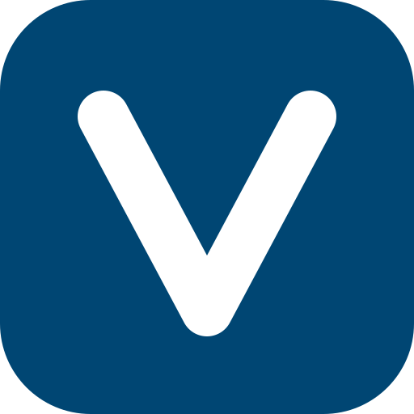
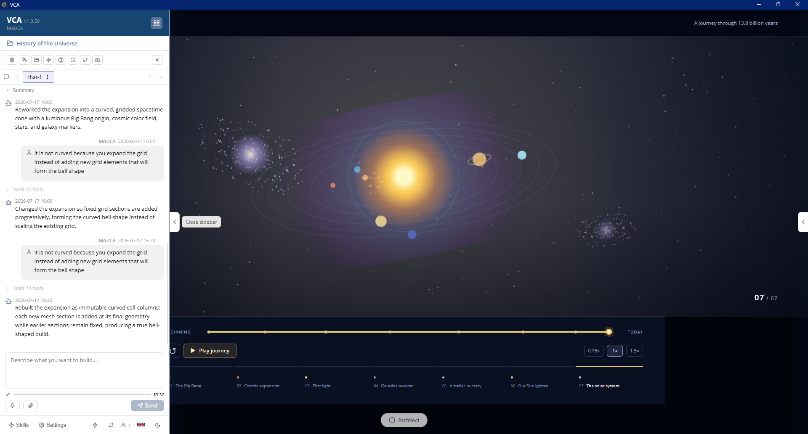
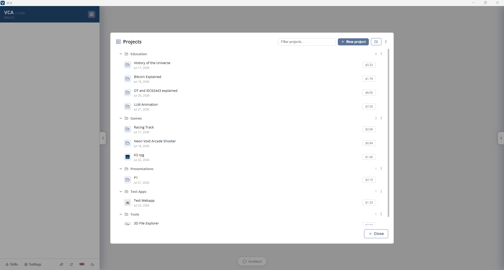
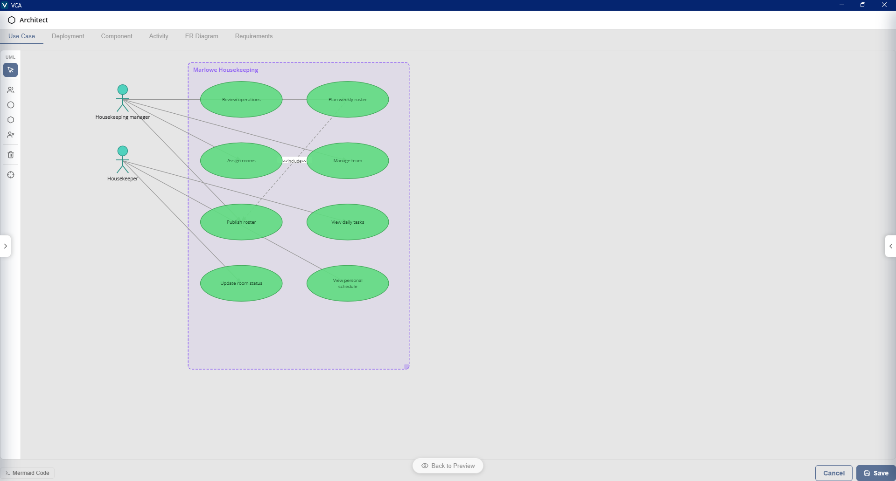
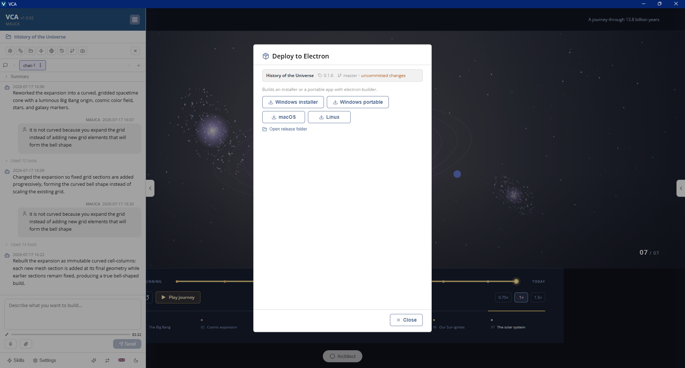

<div align="center">



# VividCreator App

**Build full-stack web apps by chatting with an AI coding agent — with a live preview, from your own infrastructure.**

[vividcreator.app](https://vividcreator.app)

[](LICENSE)
[](.nvmrc)
[](tsconfig.json)
[](package.json)
[](electron-builder.yml)

</div>

---

## What is VCA?

**VividCreator App (VCA)** is a self-hostable platform for building full-stack web applications through conversation. You describe what you want in a chat panel; an AI coding agent writes the code, and a **live preview pane** shows the running app updating in real time. Ask for changes and it iterates.

Every generated app is a complete project you can preview, download, and deploy. Two project types ship out of the box: a **full-stack app** — a **Node.js + Express** backend serving API routes plus a **React 19 + Tailwind CSS** frontend — and a pure **client-side web app** (static HTML/CSS/JS, no backend) that exports as a zip or a single self-contained HTML file. Admins can add their own app templates alongside the bundled ones.

VCA is designed for teams: it ships with **multi-user workspaces**, optional **Microsoft Entra ID (Azure AD) sign-in**, group-based access control, a reusable **skills** system, **MCP** tool integration, per-project cost tracking, and an admin console. Run it locally, in Docker, or as a packaged desktop app.

> **Note on the name:** the product name is "VividCreator App" with "VCA" as its short form, both set in [`app-config.json`](app-config.json). It's fully re-brandable — change the `name`/`shortcut` there and the UI, window title, and translations follow.

---

## Highlights

- 🗣️ **Chat-to-app** — Describe an app in natural language; the agent scaffolds and edits a real codebase for you.
- 👁️ **Live preview** — Every project runs behind a preview proxy so you see changes the moment they're written.
- 🤖 **Bring your own model** — Anthropic, OpenAI (API key **or ChatGPT Plus/Pro subscription** via Codex sign-in), Azure OpenAI & AI Foundry, OpenRouter, and OpenAI-compatible local servers, with switchable model profiles and adjustable **thinking effort** (off → max) in Settings.
- 🧩 **Skills** — Package reusable conventions and design systems as `SKILL.md` files the agent loads on demand (backend architecture, React stack, storage, UI design, UML docs, and your own).
- 🔌 **MCP tools** — Connect Model Context Protocol servers to give the agent extra capabilities, managed from the admin UI.
- 🌐 **Web search & fetch** — Built-in tools let the agent research and pull in documentation while it works.
- 🖼️ **Image generation & editing** — Generate images for the apps you build (Google Gemini, OpenAI DALL·E / gpt-image, or OpenRouter), and annotate a screenshot then edit it with AI — configured independently of the coding model.
- 🎨 **App icons** — Give each project an icon: generate or edit one from a text prompt, or upload your own. It becomes the Electron installer & installed-app icon and the deployed website's favicon.
- 📦 **Deploy your way** — Package any project as its own desktop app (Windows installer or portable exe, macOS, Linux), tag-and-push a git release to GitHub or Azure DevOps, or export a client-side app as a static zip / single HTML file — artifacts land in the project's release folder.
- 📊 **Requirements & diagrams** — Track requirements and auto-maintained UML/ER diagrams (use-case, component, activity, deployment, entity-relationship) per project.
- 👥 **Multi-user & sharing** — Per-user projects, project sharing, and public projects.
- 🔐 **Enterprise auth** — Optional Entra ID OAuth with admin/user groups; runs in an open dev mode when auth isn't configured.
- 💰 **Cost tracking** — Per-project and per-day token cost breakdowns, split per model, with input/output/cached token detail.
- 🌍 **Multilingual UI** — Ships with English, German, French, Italian, and Polish translations, switchable in Settings.
- 🖥️ **Runs anywhere** — Local Node process, Docker container, or a self-contained desktop app (macOS / Windows / Linux).

---

## Screenshots

<table>
<tr>
<td width="50%">

<p align="center"><em>Chat drives the code — the live preview shows the app running while it's written.</em></p>
</td>
<td width="50%">

<p align="center"><em>Every app is a project — organized into folders, with cost visible at a glance.</em></p>
</td>
</tr>
<tr>
<td width="50%">

<p align="center"><em>Requirements and UML/ER diagrams stay in sync with the generated code.</em></p>
</td>
<td width="50%">

<p align="center"><em>Ship it — package as a desktop installer, push a git release, or export static files.</em></p>
</td>
</tr>
</table>

---

## Quick start (local)

**Requirements:** [Node.js 24](https://nodejs.org) and npm.

```bash
git clone https://github.com/<your-org>/vca.git
cd vca
./start.sh
```

The start script will:

1. Verify Node/npm are available
2. Create `.env` from [`.env.example`](.env.example) on first run
3. Default `WORKSPACES_ROOT` to `./.vca-data` and create it
4. Install dependencies
5. Launch the dev server with auto-reload

Then open **http://localhost:3000**.

With no LLM provider configured yet, the UI loads but the agent can't do work — add an API key to `.env` (see [Configuration](#configuration)) and restart, or configure a provider in the admin UI's **Settings**, including [signing in with a ChatGPT subscription](#openai-codex-chatgpt-subscription), which needs no API key at all.

On **Windows**, use the PowerShell equivalent:

```powershell
.\start.ps1            # dev mode (auto-reload)
.\start.ps1 -Prod      # production mode
```

<details>
<summary>Running without the start script</summary>

```bash
npm install
export WORKSPACES_ROOT=./.vca-data   # required
npm run dev     # tsx watch + vite build --watch (dev)
# or
npm run build && npm start           # production
```

</details>

---

## Run with Docker

```bash
./start-docker.sh                 # build image (cached) and run in foreground
./start-docker.sh --detach        # run in the background
./start-docker.sh --port 8080     # override the host port
./start-docker.sh --rebuild       # docker build --no-cache
```

Defaults: image `vca:local`, container `vca`, data mounted from `./.vca-data-docker`. A PowerShell version, [`start-docker.ps1`](start-docker.ps1), is provided for Windows. See the [`Dockerfile`](Dockerfile) for the multi-stage build (Node 24 slim, with Git and the Azure CLI available inside the container).

---

## Desktop app

VCA can be packaged as a self-contained desktop application via [electron-builder](https://www.electron.build/). The desktop build bundles its own private Node + Git runtime, so end users need nothing preinstalled. Desktop installs can relocate their data root at any time in **Settings → Storage** (move it, or point at an existing workspace root).

```bash
npm run dist:mac      # macOS .dmg (arm64)
npm run dist:win      # Windows NSIS installer (bundles Node + Git)
npm run dist:linux    # Linux
```

Artifacts land in `release/`. For iterating on the Electron shell during development:

```bash
npm run electron:dev
```

> This packages **VCA itself**. Individual generated projects are packaged as desktop apps from within VCA — see [Deploying generated apps](#deploying-generated-apps).

---

## Deploying generated apps

Every project has a **Deploy** dialog (globe icon in the chat header); the deployment option is chosen per project in Project Settings:

| Option | What it does |
| --- | --- |
| **Electron** | Packages the generated app as its own desktop application — Windows installer or standalone portable exe, macOS, Linux — built into the project's `release/` folder. |
| **Git release** | Bumps the version, commits, tags, and pushes to the project's configured remote. Remotes come from global **Version Control** profiles (GitHub or Azure DevOps) plus per-project repo settings. |
| **Web export** | Client-side apps only: exports the static files as a zip, or as one self-contained HTML file with all assets inlined, written to `release/` as `appname-version.zip` / `.html`. |

The **Open release folder** button shows the built artifacts — the desktop app opens the OS file explorer; a browser/container deployment opens an in-app file browser with downloads. Any project can also be downloaded as a zip at any time.

Each project can carry its own **app icon** — set it in **Project Settings → App icon** (generate/edit from a prompt or upload) and it becomes the Electron installer & installed-app icon and the web app's favicon.

---

## Configuration

Configuration is via environment variables, loaded from `.env` (copied from [`.env.example`](.env.example) on first run). Most settings are also editable at runtime in **Settings** within the admin UI.

### Core

| Variable | Default | Description |
| --- | --- | --- |
| `WORKSPACES_ROOT` | `./.vca-data` | **Required.** Data root for workspaces, sessions, and admin config. |
| `PORT` | `3000` | HTTP port. |
| `BIND_HOST` | `0.0.0.0` (loopback when packaged) | Interface the server binds to. |

### LLM provider

Pick **one** provider and supply its credential — an API key for most, a ChatGPT sign-in for OpenAI Codex. Supported providers include **Anthropic**, **OpenAI**, **OpenAI Codex (ChatGPT subscription)**, **Google AI Studio (Gemini)**, **OpenAI-compatible** endpoints, **OpenRouter**, **Azure OpenAI**, and **Azure AI Foundry**.

```bash
# Examples — set the key for the provider you use:
ANTHROPIC_API_KEY=
OPENAI_API_KEY=
OPENROUTER_API_KEY=
GEMINI_API_KEY=          # Google AI Studio (Gemini); use PROVIDER=google

# Optional explicit selection / overrides:
PROVIDER=
MODEL=
THINKING_LEVEL=          # off · minimal · low · medium · high · xhigh · max
```

Google AI Studio (Gemini) uses a static API key from [aistudio.google.com](https://aistudio.google.com/apikey) — set `GEMINI_API_KEY` (or paste it in **Settings → AI Model Config**) and pick a Gemini model such as `gemini-2.5-pro`. This is the LLM/chat provider and is separate from the Gemini **image**-generation key below.

Models and API keys can also be managed from the admin UI, which fetches the live model catalog from providers that expose one. You can save several provider/model setups as named **profiles** and switch the active one from **Settings** or the quick profile switcher in the sidebar footer, and set the per-request **thinking effort** there too.

To move a whole deployment to another machine or instance, the **Settings → Config Export/Import** tab can **export** the configuration as an encrypted, password-protected file and **import** one to auto-configure the target, with a preview of exactly what it contains and what will be overwritten. You choose which categories to include: AI model config, configuration profiles, version control, network (TLS), authentication (Entra/OAuth), platform release, MCP servers, users & groups (local accounts incl. password hashes + group memberships), system prompt, app templates, skills, and environment variables. Contents are scrypt + AES-256-GCM encrypted with your password (all secrets included), so the file is portable across machines. Two things can't ride along: a ChatGPT/Codex sign-in (sign in again after importing a Codex setup), and Entra/SSO identities only resolve within the same tenant. Environment-variable secrets are re-encrypted with the target's own key on import, and importing users & groups keeps you in an admin group so it can't lock you out.

#### OpenAI Codex (ChatGPT subscription)

Runs the agent on a **ChatGPT Plus/Pro subscription** instead of a pay-per-token API key — flat-rate usage against the Codex backend with models like `gpt-5.5`. No environment variables are involved; everything happens in the admin UI:

1. In **Settings → AI Model Config**, choose **OpenAI Codex (ChatGPT subscription)** as the provider.
2. Click **Sign in with ChatGPT** and complete the login in the browser (the desktop app opens your system browser). If the login page can't redirect back — remote/Docker server, or something else already listening on port 1455 — paste the redirect URL from the browser's address bar into Settings, or use the **device code** sign-in instead.
3. Pick a model (**Browse models** lists the Codex catalog) and save.

Tokens are stored encrypted under `WORKSPACES_ROOT/admin/codex-auth.json` and refresh automatically, including rotated refresh tokens; **Sign out** in Settings revokes access for all running chats at their next message.

> ⚠️ The ChatGPT sign-in is **deployment-wide**: every user of the instance runs on that one account's subscription and shares its rate limits — a usage-limit pause hits everyone at once. Best suited to personal or small-team installs.

### Image generation (optional)

The agent can generate images for the apps it builds, and the screenshot annotator can edit an image from a text prompt. Configure this independently of the coding model in **Settings → Image Generation** — pick a provider (**Google Gemini**, **OpenAI DALL·E / gpt-image**, or **OpenRouter**), a model, and either a dedicated key or the same key as your LLM config. As a fallback, a `GOOGLE_API_KEY` in the environment is used for Gemini image generation.

The same image provider also powers the **app-icon generator** (**Project Settings → App icon**), which creates or edits a project's icon from a prompt; uploading your own icon works even without an image provider configured.

```bash
GOOGLE_API_KEY=          # optional — legacy fallback for Gemini image generation
```

### Microsoft Entra ID (optional)

Set all three to enable sign-in; otherwise VCA runs in **auth-disabled dev mode**, where every request is treated as an admin — convenient for local use, **not** for shared or public deployments.

```bash
AZURE_TENANT_ID=
AZURE_CLIENT_ID=
AZURE_CLIENT_SECRET=
# Force-disable even when the above are set:
ENTRA_AUTH_ENABLED=0
```

Admin/user group membership is managed in **Settings → Groups & Access** in the admin UI.

> ⚠️ VCA trusts the operating system's certificate store at startup, so corporate TLS-intercepting proxies generally work with verification **enabled**. TLS verification is an admin-controlled setting (**Settings → Network**) that also propagates to git subprocesses; the Docker image ships with it enabled. The `start.sh`/`start.ps1` dev scripts additionally set `NODE_TLS_REJECT_UNAUTHORIZED=0` as a convenience — review that before exposing VCA beyond localhost.

---

## How it works

```
┌──────────────────────────────────────────────────────────────┐
│  Browser SPA (React 19 + Vite)                                 │
│  chat · live preview · requirements · diagrams · admin         │
└───────────────┬───────────────────────────────┬──────────────┘
                │ /api (auth-guarded)            │ /preview (proxy)
┌───────────────▼───────────────────────────────▼──────────────┐
│  Express server (Node 24, TypeScript)                          │
│  ├─ Agent manager   → pi coding agent + your chosen LLM        │
│  ├─ Skills / MCP / web tools                                   │
│  ├─ Session & project stores (file-backed)                     │
│  ├─ App process manager → runs & previews each generated app   │
│  └─ Auth (Entra ID OAuth) · admin config · cost tracking       │
└───────────────────────────────────────────────────────────────┘
                │
        WORKSPACES_ROOT/  ← per-user workspaces, sessions, admin config
```

- The **AI coding agent** is built on [`@earendil-works/pi-coding-agent`](https://www.npmjs.com/package/@earendil-works/pi-coding-agent) and talks to whichever LLM provider you configure.
- Each generated project is scaffolded from an **app template** (full-stack Node or client-side web) and follows conventions enforced by the bundled **system prompt** and **skills** in [`defaults/`](defaults/). Admins can create templates, install them from a zip, and download them in **Settings → App Templates**.
- The **app process manager** starts each project and serves it through the `/preview` proxy, so the running app appears live in the UI.
- Finished apps ship via per-project **deployment options** — Electron desktop builds, git releases to GitHub / Azure DevOps, or static web export — see [Deploying generated apps](#deploying-generated-apps).

---

## Project structure

```
vca/
├── src/                    # Express server (TypeScript)
│   ├── server.ts           # entry point
│   ├── routes/             # api, auth, preview, platform-release
│   ├── agent-manager.ts    # LLM agent orchestration
│   ├── app-process-manager.ts  # runs & previews generated apps
│   ├── mcp-*.ts            # MCP client & server management
│   ├── *-store.ts          # file-backed session/user/project stores
│   └── ...                 # skills, cost, auth, admin, env vars, TLS, …
├── web/                    # React 19 SPA (Vite)
├── electron/               # Electron main + preload (desktop shell)
├── defaults/               # seeded system prompt, skills, app templates
│   ├── systemprompt/
│   ├── skills/
│   └── templates/
├── scripts/bundle-runtime.mjs   # bundles Node + Git for desktop builds
├── start.sh / start.ps1         # local run
├── start-docker.sh / .ps1       # containerized run
├── Dockerfile
└── electron-builder.yml         # desktop packaging config
```

---

## Development

```bash
npm run dev          # server (tsx watch) + web (vite watch) together
npm run dev:server   # server only
npm run dev:web      # web bundle only
npm run build        # tsc + vite production build
```

**Tech stack:** TypeScript · Node.js 24 · Express 5 · React 19 · Vite 8 · Electron 42. (VCA's own UI is hand-written CSS with design tokens; generated **user apps** use Tailwind CSS.)

---

## Contributing

Contributions are welcome! Please open an issue to discuss substantial changes before submitting a PR. When contributing:

- Keep changes focused and match the surrounding code style.
- Run `npm run build` to ensure the server and web bundle compile.
- Note that generated **user apps** are self-contained offline projects with no CDN imports — full-stack ones are Vite-built React 19 + Tailwind CSS on an Express backend; client-side ones are plain HTML/CSS/JS under `public/` — see [`defaults/`](defaults/) for the conventions the agent follows.

---

## Disclaimer

VCA is open-source software provided **as-is, without warranty of any kind** — see the [MIT License](LICENSE) for details. AI can make mistakes: review what the agent generates before relying on it, especially before deploying anything that handles sensitive data, authentication, or payments.

You are solely responsible for the applications you build with VCA and for the data those applications process, including compliance with any applicable laws and regulations (e.g. data protection and privacy rules). Connected LLM and image-generation providers (Anthropic, OpenAI, Azure, OpenRouter, etc.) are third-party services subject to their own terms — usage costs charged by those providers are your responsibility.

---

## License

Released under the [MIT License](LICENSE).
